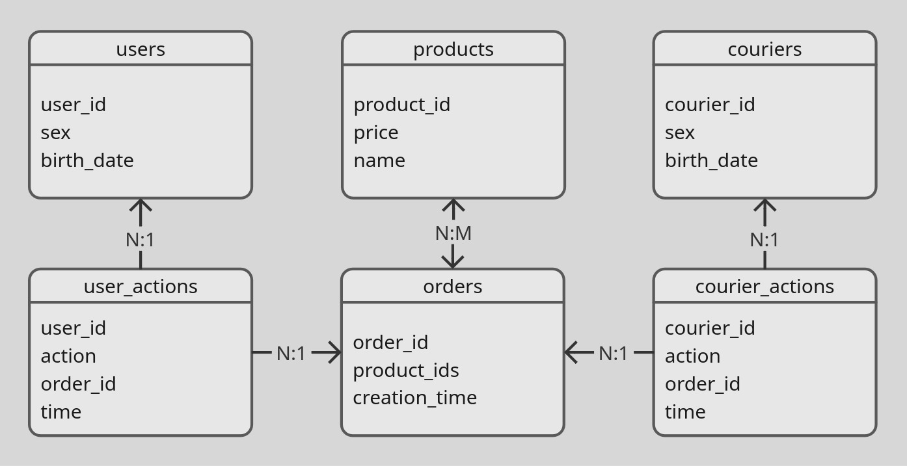
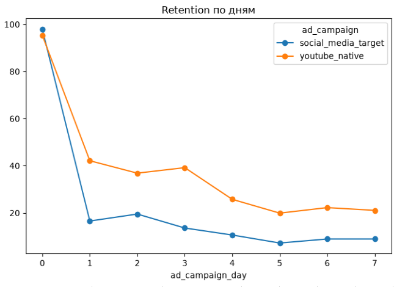
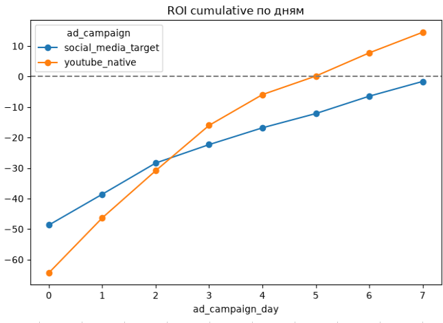
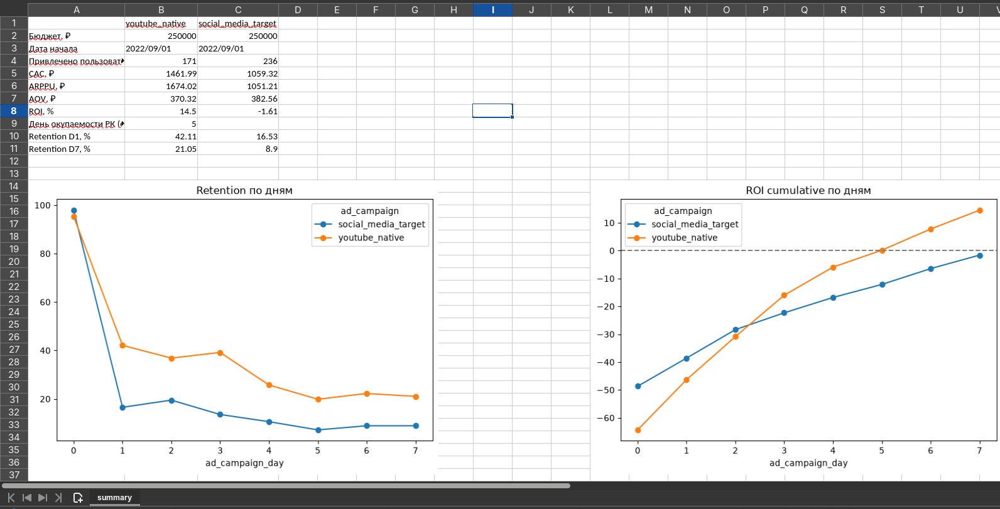

# Сравнение эффективности 2 рекламных кампаний

## Саммари
- Сравнение 2 каналов привлечения (YouTube-интеграция vs таргет в соцсетях) по CAC, ARPPU, AOV, ROI и retention на данных учебной БД PostgreSQL
- Пайплайн на Python генерирует SQL-запрос из списков user_id и собирает финальный отчёт с графиками
- В итоге YouTube-интеграция окупилась на 5-й день при более высоком CAC, но большем числе заказов на пользователя, таргет пока в минусе
- Рекомендация – собрать данные за 14 или 28 дней

<br>

## Задача
Сервис доставки продуктов запустил параллельно 2 рекламные кампании (РК) для привлечения новых клиентов. Нужно понять, какая из них:
- привлекает больше лояльных пользователей
- быстрее окупилась (и окупилась ли)

<br>

## Входные данные
**База данных:** учебная БД на PostgreSQL для студентов курса «Симулятор SQL» от karpov courses

**Схема данных**


**Период:** 16 дней (2022/08/24 - 2022/09/08)

**Данные рекламных кампаний**

|                             | Кампания 1                                               | Кампания 2                            |
| --------------------------- | -------------------------------------------------------- | ------------------------------------- |
| Канал                       | Интеграция у блогера<br>на YouTube-канале<br>о кулинарии | Таргетированная реклама<br>в соцсетях |
| Бюджет                      | 250,000 ₽                                                | 250,000 ₽                             |
| Дата старта                 | 2022/09/01                                               | 2022/09/01                            |
| Список user_id              | 8631, 8632, 8638... 10135                                | 8629, 8630, 8644...10131              |

<br>

## Стек
- Python – скрипты для генерации SQL-запроса и создания отчёта в Excel
- Jupyter Notebook – отладка python-скриптов
- SQL – запрос к учебной БД на PostgreSQL
- Redash – экспорт промежуточной таблицы
- Mermaid – фиксация пайплайна

<br>

## Процесс
### Выбор нужных метрик
Для выполнения задачи (кол-во лояльных пользователей, окупаемость) понадобится измерение Retention и ROI. Обе кампании начались 1 сентября, данные есть до 8 сентября. Поэтому получится их замерить за 7 дней, где 1 сентября – 0-ой день, точка отсчёта.

Дополнительный контекст дадут расходы на привлечение пользователя (CAC), выручка на платящего пользователя (ARPPU), средний чек (AOV).

Итоговый набор метрик для сравнения рекламных кампаний: 
- CAC
- ARPPU
- AOV
- ROI
- День окупаемости (если есть)
- ROI cumulative
- Retention (D1, D7)

<br>

### Пайплайн и логика его работы
Для расчёта этих метрик нужен пайплайн, который получает данные от маркетинга и обогащает их заказами из БД. Ниже – как он устроен.

>[!IMPORTANT]
> Проект обновлён. В предыдущей версии расчёты метрик и построение графиков выполнялись 3 SQL-запросами в Redash. У этого подхода есть ряд минусов, в нём нужно:
> - вставлять вручную списки по ~ 200 user_id для каждой РК в SQL-запрос
> - создавать разные SQL-запросы для расчёта метрик за весь период (CAC, ARPPU, AOV, ROI) и ежедневных (retention, ROI cumulative) или комментировать часть единого запроса (расчёт метрик за весь период или расчёт метрик по дням)
> - собирать итоговый отчёт с таблицей и графиками вручную (например, в xlsx-файл)
> 
> В новой версии это учтено и автоматизирована большая часть c помощью Python:
> - списки user_id автоматически попадают в SQL-запрос как CTE-часть
> - остался 1 SQL-запрос, он осуществляется к БД вручную из-за ограниченного доступа к учебной БД
> - итоговый отчёт автоматически сохраняется как xlsx-файл, в нём таблица по метрикам за весь период и 2 графика (retention, ROI cumulative)

```mermaid
---
config:
    theme: dark
    layout: elk
    flowchart:
        curve: basis
        defaultRenderer: elk
---

flowchart TD

A(table_ad_campaigns_raw.xlsx) --> B([sql_generator.py])

subgraph Group1 [Генерация SQL-запроса к БД и подсчёт юзеров в каждой РК]
B --> |"дополняет таблицу размерами когорт по&nbsp;каждой РК"| C[table_ad_campaigns_processed.xlsx]
B --> |"генерирует"|D([enrich_ad_campaign_users_with_their_orders.sql])
end

D --> |"выполняю к учебной БД в&nbsp;Redash и экспортирую как xlsx"| E[table_ad_campaigns_users_and_their_orders.xlsx]
E --> F([report_creator.py])
C --> F

subgraph Group2 [Подсчёт нужных метрик и генерация отчёта для маркетинга]
F --> |"считает метрики РК за&nbsp;весь период: CAC, ARPPU, AOV, ROI"| G[table_summary_metrics]
F --> |"считает метрики РК по&nbsp;дням для графиков retention, roi_cumulative"|H[table_daily_metrics]
G --> |"таблица с CAC, ARPPU, AOV, ROI"|I(ad_campaigns_report.xlsx)
H --> |"графики retention, roi_cumulative"|I
end

style Group1 fill:#0d1b2a,stroke:#333,stroke-width:2px
style Group2 fill:#0c1f17,stroke:#333,stroke-width:2px
```





Допустим, с отделом маркетинга договорились присылать данные на анализ РК в формате xlsx с конкретными колонками.

`table_ad_campaigns_raw.xlsx`

| Колонка      | Тип    | Описание                    |
| ------------ | ------ | --------------------------- |
| ad_campaign  | string | Название рекламной кампании |
| budget       | float  | Бюджет РК в рублях          |
| date_start   | date   | Дата старта РК              |
| user_id_list | string | ID юзеров через запятую     |

<br>

Применяю python-скрипт [sql_generator.py](python/sql_generator.py) для 2 целей.
Первая – посчитать кол-во юзеров (элементов в `user_id_list`) в каждой РК для расчёта CAC и Retention. Сохраняю в новую таблицу.

`table_ad_campaigns_processed.xlsx`

| Колонка      | Тип    | Описание                       | Источник                                                             |
| ------------ | ------ | ------------------------------ | -------------------------------------------------------------------- |
| ad_campaign  | string | Название рекламной кампании    | `table_ad_campaigns_raw.xlsx`                                        |
| budget       | float  | Бюджет РК в рублях             | `table_ad_campaigns_raw.xlsx`                                        |
| date_start   | date   | Дата старта РК                 | `table_ad_campaigns_raw.xlsx`                                        |
| user_id_list | string | ID юзеров через запятую        | `table_ad_campaigns_raw.xlsx`                                        |
| cohort_size  | int    | Размер когорты (кол-во юзеров) | рассчитано в Python: `lambda x: len(x.split(","))` для каждой строки |

Вторая — создать SQL-запрос для обращения к БД и получения таблицы с юзерами из РК и их заказами. Это будет основной источник данных для расчёта метрик. В этом кейсе 2 рекламные кампании, однако адаптируем запрос сразу для 3+ рекламных кампаний.

```python
sql_query_full = (
        "WITH \n"
        "table_ad_campaign_users as (\n"
        f"{sql_query_cte_part}\n"
        ")\n"
        f"{sql_query_main_part}"
)
```

```python
# SQL-query: CTE part
cte_part = []
for _, row in df.iterrows():
    ad_campaign_block = (
        "    SELECT\n"
        f"    '{row['ad_campaign']}' as ad_campaign,\n"
        f"    unnest(array[{row['user_id_list']}]) as user_id"
    )
    cte_part.append(ad_campaign_block)
sql_query_cte_part = "\nUNION\n".join(cte_part)
```

```python
# SQL-query: main part
sql_query_main_part = """
SELECT
    user_id,
    order_id,
    order_date,
    sum(price) as order_value,
    ad_campaign
FROM
	 ... # subqueries and JOINs
GROUP BY
    user_id, order_id, order_date, ad_campaign
"""
```

Пример полученного запроса: [enrich_ad_campaign_users_with_their_orders.sql](sql/enrich_ad_campaign_users_with_their_orders.sql)

> [!tip]
> В запросе НЕ использованы подзапросы вида «сначала посчитать стоимость всех заказов в базе, потом отфильтровать по нужным юзерам». Таблица с юзерами из РК обогащается нужными данными через JOIN.

<br>

Доступ напрямую к учебной БД ограничен, поэтому запрос в Redash выполняю вручную и экспортирую таблицу как xlsx.

`table_ad_campaigns_users_and_their_orders_YYYY_MM_DD.xlsx`
(экспортированный файл из Redash получает имя по маске "queryname_YYYY_MM_DD")

| Колонка     | Тип    | Описание                    | Источник                                                                           |
| ----------- | ------ | --------------------------- | ---------------------------------------------------------------------------------- |
| ad_campaign | string | Название рекламной кампании | `enrich_ad_campaign_users_with_their_orders.sql`                                   |
| user_id     | int    | ID юзера                    | `enrich_ad_campaign_users_with_their_orders.sql`                                   |
| order_id    | int    | ID заказа                   | таблица `orders` в БД                                                                |
| order_date  | date   | Дата оформления заказа      | таблица `orders` в БД                                                                |
| order_value | float  | Стоимость заказа            | таблицы `orders` (список products_ids в заказе), `products` (price по каждому product) |

Таблиц `table_ad_campaigns_users_and_their_orders_YYYY_MM_DD.xlsx` и `table_ad_campaigns_processed.xlsx` достаточно для расчёта всех нужных метрик. На их основе [report_creator.py](python/report_creator.py) считает метрики, создаёт графики и сохраняет их в xlsx-файл.
```python
# xlsx export from Redash has "queryname_YYYY_MM_DD.xlsx" file name
current_date = datetime.date.today().strftime('%Y_%m_%d')
df_orders = pd.read_excel(f"table_ad_campaigns_users_and_their_orders_{current_date}.xlsx")

campaign_stats = df_orders.groupby("ad_campaign", as_index=False).agg(
    total_revenue = ("order_value", "sum"),
    paying_users = ("user_id", "nunique"),
    orders_count = ("order_id", "nunique")
)

# summary metrics table: cac, arppu, aov, roi
df_summary = pd.read_excel("table_ad_campaigns_processed.xlsx")
df_summary = df_summary.merge(campaign_stats, on = "ad_campaign", how = "left")

df_summary["cac"] = round(df_summary["budget"] / df_summary["cohort_size"],2)
df_summary["arppu"] = round(df_summary["total_revenue"] / df_summary["paying_users"],2)
df_summary["aov"] = round(df_summary["total_revenue"] / df_summary["orders_count"],2)
df_summary["roi"] = round((df_summary["total_revenue"] - df_summary["budget"]) / df_summary["budget"] * 100,2)
```

<br>

Пример создания графика и вставки в финальный xlsx-файл
```python
# retention: pivot --> plot --> save plot as png --> insert png to xlsx
retention_graph = df_daily.pivot(index="ad_campaign_day", columns="ad_campaign", values="retention").plot(
    marker="o", title="Retention по дням", figsize=(8, 5)
)
retention_png = retention_graph.get_figure()
retention_png.savefig("chart_retention.png", bbox_inches="tight")
plt.close(retention_png)

wb = load_workbook("ad_campaigns_report.xlsx")
ws = wb["summary"]
img1 = Image("chart_retention.png")
img1.anchor = "A14"
ws.add_image(img1)
```
<br>

Колонки итоговой таблицы `ad_campaigns_report.xlsx` 

| Колонка       | Тип   | Описание                                   | Источник                                                                                                                |
| ------------- | ----- | ------------------------------------------ | ----------------------------------------------------------------------------------------------------------------------- |
| budget        | int   | Бюджет РК в рублях                         | `table_ad_campaigns_processed.xlsx`                                                                                     |
| date_start    | date  | Дата старта РК                             | `table_ad_campaigns_processed.xlsx`                                                                                     |
| cohort_size   | int   | Размер когорты (кол-во юзеров)             | `table_ad_campaigns_processed.xlsx`                                                                                     |
| cac           | float | Цена привлечения юзера                     | Рассчитано в Python: `budget / cohort_size` из `table_ad_campaigns_processed.xlsx`                                      |
| arppu         | float | Выручка на платящего юзера                 | Рассчитано в Python на основе `order_value` и `user_id` из `table_ad_campaigns_users_and_their_orders_YYYY_MM_DD.xlsx`  |
| aov           | float | Средний чек                                | Рассчитано в Python на основе `order_value` и `order_id` из `table_ad_campaigns_users_and_their_orders_YYYY_MM_DD.xlsx` |
| roi           | float | Окупаемость РК                             | Рассчитано в Python: `order_value` из `table_ad_campaigns_users_and_their_orders_YYYY_MM_DD.xlsx` и `budget`            |
| payback_day   | int   | День окупаемости РК (если есть)            | Рассчитано в Python: минимальный `ad_campaign_day`, где `roi_cumulative>=0`                                           |
| retention_d1  | float | Retention на 1-ый день (если есть данные)  | Рассчитано в Python: % платящих юзеров на D1 от `cohort_size`                                                           |
| retention_d7  | float | Retention на 7-ой день (если есть данные)  | Рассчитано в Python: % платящих юзеров на D7 от `cohort_size`                                                           |
| retention_d30 | float | Retention на 30-ый день (если есть данные) | Рассчитано в Python: % платящих юзеров на D30 от `cohort_size`                                                          |

<br>

## Результат
### Итоговая таблица метрик

| Метрика                                         | Интеграция у блогера<br>на YouTube-канале<br>о кулинарии | Таргет в соцсетях |
| ----------------------------------------------- | -------------------------------------------------------- | ----------------- |
| Бюджет, ₽                                       | 250,000                                                  | 250,000           |
| Дата начала                                     | 1.09.2022                                                | 1.09.2022         |
| Привлечено<br>пользователей                     | 171                                                      | 236               |
| CAC, ₽                                          | 1,461.99                                                 | 1,059.32          |
| ARPPU, ₽                                        | 1,674.02                                                 | 1,051.21          |
| AOV, ₽                                          | 370.32                                                   | 382.56            |
| ROI, %                                          | 14.50                                                    | -1.61             |
| День<br>окупаемости РК<br>(если есть за 7 дней) | Day 5                                                    | пока нет          |
| Retention D1, %<br>(округл. до целого)          | 42                                                       | 17                |
| Retention D7, %<br>(округл. до целого)          | 21                                                       | 9                 |

<br>

### Графики
За ось X на обоих графиках взят день РК от D0 до D7.

#### Retention (D1 – D7)


- значения в D0 ниже 100%, так как не все юзеры из присланных списков совершили целевое действие (оформление заказа) в Day 0 
- в обеих РК падение с 1-ого по 7-ой день произошло в ~ 2 раза
	- YouTube: 42% –> 21%
	- таргет: 17% --> 9%
- пользователей с youtube-интеграции оставалось больше в ~ 2,4 раза
	- D1: 42% / 17% ~ 2,47
	- D7: 21% / 9% ~ 2,33

<br>

#### Накопительный ROI


- YouTube-интеграция вышла в плюс на 5-ый день
- таргет в соцсетях пока не вышел в плюс, но может выйти в ближайшие дни
- ROI для обеих РК ещё не вышел на плато

<br>

### Отчёт в формате xlsx



- таблица транспонирована для удобства сравнения разных РК
- строки имеют user friendly названия (бюджет, дата начала и т.п.)

<br>

## Выводы
- С YouTube пришло меньше юзеров за тот же бюджет (поэтому CAC выше), но за счёт кол-ва сделанных заказов РК уже окупилась
- Исходя из отношения ARPPU / AOV определяем среднее кол-во заказов на пользователя для каждой РК: юзер с YouTube сделал ~ 4,5 заказа в среднем за неделю, юзер из таргета ~ 2,7. При примерно равном среднем чеке это объясняет, почему YouTube-интеграция принесла больше выручки и уже окупилась.

Данные за 7 дней пока только частично отвечают на поставленные в начале вопросы.
- Retention с похожими значениями на D5-D7 – пока ещё не плато, поэтому назвать % оставшихся пользователей рано
- В сегменте доставки продуктов влияет эффект дня недели: часть клиентов покупает раз в неделю. Данные за 2-4 недели дадут более точную цифру о том, сколько пользователей осталось.
- ROI таргетированной рекламы пока в минусе, но ещё растёт в последние дни по ~5%. Пока рано отвечать на вопрос «окупилась ли эта РК?»
- Когда ROI обеих РК выйдет на плато, мы поймём потолок эффективности каждого канала и сможем принять более обоснованное решение о следующих РК

<br>

## Рекомендация
**Собрать данные за 14 или 28 дней** для более точных Retention и ROI по обеим РК. После этого решать, стоит ли проводить РК по тем же каналам.

<br>

## Рефлексия по проекту
- В 1-ой итерации сделал попытку написать 1 SQL-запрос для расчёта всех метрик, одноко его пришлось разделить на 3 связанных запроса
- Во 2-ой итерации получилось автоматизировать почти все этапы от получения таблицы от маркетинга на входе до создания итогового отчёта в формате xlsx
- Чем лучше знаешь метрики продукта, тем быстрее понимаешь, как оптимизировать написание SQL-запроса или Python-скрипта сразу на старте
- Стал лучше понимать Retention, ROI и для чего ждать на них плато
