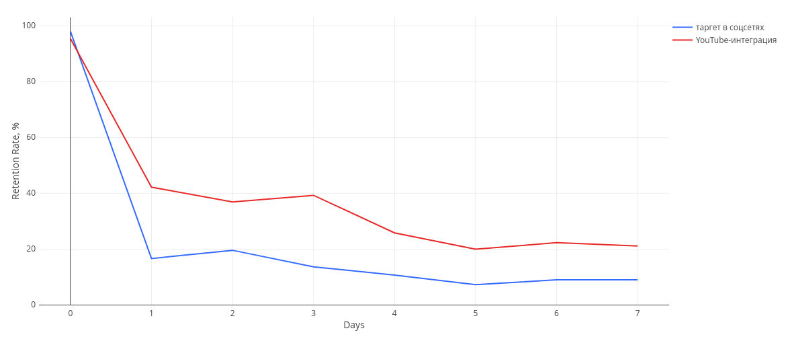
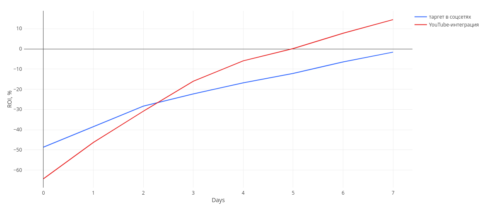

# Сравнение эффективности 2 рекламных кампаний

<br>

## Задача
Сервис доставки продуктов запустил параллельно 2 рекламные кампании (РК) для привлечения новых клиентов. Нужно понять, какая из них:
- привлекает больше лояльных пользователей
- быстрее окупилась (и окупилась ли)

<br>

## Входные данные
**База данных:** учебная БД на PostgreSQL для студентов курса «Симулятор SQL» от karpov courses

**Схема данных**


**Период:** 16 дней (2022/08/24 - 2022/09/08)

**Данные рекламных кампаний**
|| Кампания 1 | Кампания 2 |
| --- | --- | --- |
| Канал | Интеграция у блогера<br>на YouTube-канале<br>о кулинарии | Таргетированная реклама<br>в соцсетях |
| Бюджет | 250,000 ₽ | 250,000 ₽ |
| Дата старта | 2022/09/01 | 2022/09/01 |
| Привлечено<br>пользователей | 171 | 236 |
| Список user_id| 8631, 8632, 8638... 10135| 8629, 8630, 8644...10131 |

<br>

## Стек
- SQL – запросы к БД на PostgreSQL
- Redash – вывод результирующих таблиц и графиков

<br>

## Процесс
### Выбор нужных метрик
Для выполнения задачи (кол-во лояльных пользователей, окупаемость) понадобится измерение Retention и ROI. Обе кампании начались 1 сентября, данные есть до 8 сентября. Поэтому получится их замерить за 7 дней, где 1 сентября – 0-ой день, точка отсчёта.

Дополнительный контекст дадут расходы на привлечение пользователя (CAC), выручка на платящего пользователя (ARPPU), средний чек (AOV).

Итоговый набор метрик для сравнения рекламных кампаний: 
- CAC
- ARPPU
- AOV
- ROI
- Retention (D1, D7)

### SQL-запрос
На входе есть 2 списка юзеров. Сформирую таблицу с ними и обогащу данными по заказам, чтобы получить набор колонок: `ad_campaign`, `user_id`, `order_id`, `order_date`, `order_value`.

Какие таблицы создаю, логика действий:
1. `ad_campaign`, `user_id` – создаю начальную таблицу на основе 2 присланных списков юзеров и пометкой о том, через какую РК они пришли
2. `ad_campaign`,`user_id`, `order_id`, `order_date` – проверяю действия юзеров из РК по таблице `user_actions`, добавляю их заказы через LEFT JOIN
3. `ad_campaign`,`user_id`, `order_id`, `order_date`, `order_value` – обращаюсь к таблице `orders` за списком товаров в заказе и к таблице `products` за ценами на эти товары, чтобы посчитать стоимость каждого заказа


> При создании таблицы НЕ использованы подзапросы вида «сначала посчитать стоимость всех заказов в базе, потом отфильтровать по нужным юзерам». Таблица с юзерами из РК обогащается нужными данными через JOIN.

Этой таблицы достаточно для сравнения РК по взятым метрикам. Однако дальше идёт развилка, так как у метрик разная группировка:
- **за весь период:** CAC, ARPPU, AOV, ROI
- **по дням:** Retention (D0-D7), накопительный ROI

<br>

Поэтому весь SQL-запрос делится на 3 части.

[01_ad_campaign_users_enriched.sql](sql/01_ad_campaign_users_enriched.sql) – создание таблицы с заказами юзеров из РК (колонки `ad_campaign`,`user_id`, `order_id`, `order_date`, `order_value`)

<br>

[02_ad_campaign_summary_metrics.sql](sql/02_ad_campaign_summary_metrics.sql) – расчёт итоговых метрик для каждой РК

```sql
SELECT
    ad_campaign,
    cohort_size,
    round(250000 / cohort_size::decimal,2) as cac,
    round(sum(order_value)::decimal / COUNT(DISTINCT user_id),2) as arppu,
    round(sum(order_value)::decimal / COUNT(order_id),2) as avg_check,
    round((sum(order_value) - 250000)::decimal / 250000 *100,2) as roi
FROM (
    SELECT
        ad_campaign,
        cohort_size,
        user_id,
        order_id,
        order_date,
        order_value
    FROM 
        table_ad_campaign_users_enriched
    LEFT JOIN table_ad_campaign_cohort_size USING (ad_campaign)
) table_ad_campaign_users_enriched_plus_cohort_sizes
GROUP BY
    ad_campaign, cohort_size
```
<br>

[03_ad_campaign_daily_metrics.sql](sql/03_ad_campaign_daily_metrics.sql) – расчёт Retention, ROI по дням для каждой РК

```sql
SELECT
    order_date,
    paid_user_count,
    round(paid_user_count::decimal / cohort_size * 100,2) as retention,
    round((sum(revenue_this_day) OVER (partition by ad_campaign ORDER by order_date)::decimal - 250000) / 250000 * 100,2) as roi_cumulative,
    ad_campaign,
    row_number() OVER (PARTITION BY ad_campaign ORDER BY order_date) - 1 as ad_campaign_day
FROM (
    SELECT
        order_date,
        sum(order_value) as revenue_this_day,
        COUNT(distinct user_id) as paid_user_count,
        ad_campaign,
        cohort_size
    FROM
        table_ad_campaign_users_enriched
    LEFT JOIN table_ad_campaign_cohort_size USING (ad_campaign)
    GROUP BY
        ad_campaign, order_date, cohort_size
    ) stats_by_date_with_cohort_size
```

<br>

## Результат
### Итоговая таблица метрик

| Метрика | Интеграция у блогера<br>на YouTube-канале<br>о кулинарии | Таргет в соцсетях |
| --- | --- | --- |
| Бюджет, ₽ | 250,000 | 250,000 |
| Дата начала | 1.09.2022 | 1.09.2022|
| Привлечено<br>пользователей| 171 | 236 |
| CAC, ₽| 1,461.99 | 1,059.32 |
| ARPPU, ₽ | 1,674.02 | 1,051.21 |
| AOV, ₽ | 370.32 | 382.56 |
| ROI, % | 14.50 | -1.61|
| День<br>окупаемости РК<br>(если есть за 7 дней) | Day 5 | пока нет |
| Retention D1, %<br>(округл. до целого) | 42 | 17 |
| Retention D7, %<br>(округл. до целого) | 21 | 9 |

<br>

### Графики
За ось X на обоих графиках взят день РК от D0 до D7.

<br>

#### Retention (D1 – D7)


- значения в D0 ниже 100%, так как не все юзеры из присланных списков совершили целевое действие (оформление заказа) в Day 0 
- в обеих РК падение с 1-ого по 7-ой день произошло в ~ 2 раза
	- YouTube: 42% –> 21%
	- таргет: 17% --> 9%
- пользователей с youtube-интеграции оставалось больше в ~ 2,4 раза
	- D1: 42% / 17% ~ 2,47
	- D7: 21% / 9% ~ 2,33

<br>

#### Накопительный ROI


- YouTube-интеграция вышла в плюс на 5-ый день
- таргет в соцсетях пока не вышел в плюс, но может выйти в ближайшие дни
- ROI для обеих РК ещё не вышел на плато

<br>

## Выводы
- С YouTube пришло меньше юзеров за тот же бюджет (поэтому CAC выше), но за счёт кол-ва сделанных заказов РК уже окупилась
- Исходя из отношения ARPPU / AOV определяем среднее кол-во заказов на пользователя для каждой РК: юзер с YouTube сделал ~ 4,5 заказа в среднем за неделю, юзер из таргета ~ 2,7. При примерно равном среднем чеке это объясняет, почему YouTube-интеграция принесла больше выручки и уже окупилась.

Данные за 7 дней пока только частично отвечают на поставленные в начале вопросы.
- Retention с похожими значениями на D5-D7 – пока ещё не плато, поэтому назвать % оставшихся пользователей рано
- В сегменте доставки продуктов влияет эффект дня недели: часть клиентов покупает раз в неделю. Данные за 2-4 недели дадут более точную цифру о том, сколько пользователей осталось.
- ROI таргетированной рекламы пока в минусе, но ещё растёт в последние дни по ~5%. Пока рано отвечать на вопрос «окупилась ли эта РК?»
- Когда ROI обеих РК выйдет на плато, мы поймём потолок эффективности каждого канала и сможем принять более обоснованное решение о следующих РК

<br>

## Рекомендация
**Собрать данные за 14 или 28 дней** для более точных Retention и ROI по обеим РК. После этого решать, стоит ли проводить РК по тем же каналам.

<br>

## Рефлексия по проекту
- Написание 1 SQL-запроса привёло к 3 связанным запросам. В будущем их выполнение можно реализовать в Python (сsv от маркетинга на входе –> итоговые таблицы и графики на выходе)
- Чем лучше знаешь метрики продукта, тем быстрее понимаешь, как оптимизировать написание SQL-запроса сразу на старте
- Стал лучше понимать Retention, ROI и для чего нужно ждать на них плато
